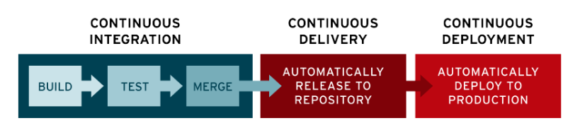

This course is from [here](https://www.udemy.com/course/jenkins-from-zero-to-hero/learn/lecture/12847804#overview)

# Jenkins Tips & Tricks
## 86. Trigger your Jobs from Bash Scripts (No parameters)
This [**session**](https://www.udemy.com/course/jenkins-from-zero-to-hero/learn/lecture/13085766#overview) is about how to trigger a Jenkins job from bash script. For example `scripts/trigger_jenkins_job.sh`:
```bash
#!/bin/sh
PASSWD="${1}"
CRUMB=$(curl -u "admin:${PASSWD}" -s 'http://gcp_jenkins/crumbIssuer/api/xml?xpath=concat(//crumbRequestField,":",//crumb)')
echo "Collected crumb=${CRUMB}"
JOB_URL='http://gcp_jenkins/job/my-first-job'
echo "Trigger job from ${JOB_URL}..."
curl -u "admin:${PASSWD}" -H "${CRUMB}" -X POST "$JOB_URL/build?delay=0sec"
echo "Return code=$?"
```
For some FAQ regarding to this session, please check [Session 85](https://www.udemy.com/course/jenkins-from-zero-to-hero/learn/lecture/16495944#questions/9476468).

## 87. Trigger your Jobs from Bash Scripts (With Parameters)
This [**session**](https://www.udemy.com/course/jenkins-from-zero-to-hero/learn/lecture/13085770#questions/9476468) is about on how to trigger a Jenkins job with parameter(s). For example `scripts/trigger_jenkins_job_with_params.sh`:
```bash
#!/bin/sh
PASSWD="${1}"
CRUMB=$(curl -u "admin:${PASSWD}" -s 'http://gcp_jenkins/crumbIssuer/api/xml?xpath=concat(//crumbRequestField,":",//crumb)')
echo "Collected crumb=${CRUMB}"
JOB_URL='http://gcp_jenkins/job/ansible-task'
echo "Trigger job from ${JOB_URL}..."
MESSAGE='Test'
curl -u "admin:${PASSWD}" -H "${CRUMB}" -X POST "$JOB_URL/buildWithParameters?ANSIBLE_MSG=${MESSAGE}"
echo "Return code=$?"
```

# Jenkins & Email
In this section we'll learn how to integrate Jenkins with Email using AWS SES & GMail. Having notifications via Email is quite useful, because if any Job fails, then Jenkins is going to notify you.


## 89. Install a Mail Plugin

## 90. Integrate Jenkins and AWS Simple Email Service

## 91. Integrate Jenkins and Gmail
This [**session**](https://www.udemy.com/course/jenkins-from-zero-to-hero/learn/lecture/13086106#questions/9476468) introduce how to integrate Gmail into Jenkins.
1. Check [this link](https://www.androidauthority.com/gmail-smtp-settings-801100/) to get SMTP server of Gmail.
2. Setup SMTP according to [link here](https://www.360logica.com/blog/email-notification-in-jenkins/).

# Jenkins & Maven

## 93. Introduction: Jenkins & Maven
This [**session**](https://www.udemy.com/course/jenkins-from-zero-to-hero/learn/lecture/13087394#overview) is about integration between Jenkins and [Maven](https://maven.apache.org/).

## 94. Install the Maven Plugin

## 95. Install the GIT Plugin

## 96. Learn how to clone a GIT/GITHUB repository from Jenkins
This [**session**](https://www.udemy.com/course/jenkins-from-zero-to-hero/learn/lecture/13087402#overview) will teach you on how to clone the repo [simple-java-maven-app](https://github.com/jenkins-docs/simple-java-maven-app) from Jenkins by creating a new item called `maven-job`.

# Jenkins & GIT
For the docker-compose file used in this section to build Git server, please refer to [section10.zip](resources/section10.zip).

## 104. Create a Git Server using Docker
This [**session**](https://www.udemy.com/course/jenkins-from-zero-to-hero/learn/lecture/13130222#overview) will teach you on how to create Git server using docker-compose file.

## 105. Create your first Git Repository
This [**session**](https://www.udemy.com/course/jenkins-from-zero-to-hero/learn/lecture/13130228#overview)

## 106. Create a Git User to interact with your Repository
This [**session**](https://www.udemy.com/course/jenkins-from-zero-to-hero/learn/lecture/13130232#overview)

## 107. Upload the code for the Java App in your Repo
This [**session**](https://www.udemy.com/course/jenkins-from-zero-to-hero/learn/lecture/13130916#overview) will clone repo [jenkins-docs/simple-java-maven-app](https://github.com/jenkins-docs/simple-java-maven-app) and then upload it to your Git server.
```bash
# git clone https://github.com/jenkins-docs/simple-java-maven-app.git
```

## 108. Integrate your Git server to your maven Job
This [**session**](https://www.udemy.com/course/jenkins-from-zero-to-hero/learn/lecture/13142370#overview)

## 109. Learn about Git Hooks
This [**session**](https://www.udemy.com/course/jenkins-from-zero-to-hero/learn/lecture/13142378#overview)

## 110. Trigger your Jenkins job using a Git Hook
This [**session**](https://www.udemy.com/course/jenkins-from-zero-to-hero/learn/lecture/13142444#overview)

# Jenkins & DSL
For the resources of this section, please refer to [section11.zip](resources/section11.zip).

## 112. Introduction: Jenkins DSL
This [**section**](https://www.udemy.com/course/jenkins-from-zero-to-hero/learn/lecture/13147906#overview)

## 113. Install the DSL Plugin
This [**section**](https://www.udemy.com/course/jenkins-from-zero-to-hero/learn/lecture/13147906#overview)

## 114. What is a Seed Job in DSL?
This [**section**](https://www.udemy.com/course/jenkins-from-zero-to-hero/learn/lecture/13147958#overview)

## 115. Understand the DSL Structure
This [**section**](https://www.udemy.com/course/jenkins-from-zero-to-hero/learn/lecture/13148042#overview)

## 116. Description
This [**section**](https://www.udemy.com/course/jenkins-from-zero-to-hero/learn/lecture/13148126#overview)

## 117. Parameters
This [**section**](https://www.udemy.com/course/jenkins-from-zero-to-hero/learn/lecture/13148220#overview)

## 118. SCM
This [**section**](https://www.udemy.com/course/jenkins-from-zero-to-hero/learn/lecture/13148282#overview)

## 119. Triggers
This [**section**](https://www.udemy.com/course/jenkins-from-zero-to-hero/learn/lecture/13148390#overview)

## 120. Steps
This [**section**](https://www.udemy.com/course/jenkins-from-zero-to-hero/learn/lecture/13148504#overview)

## 121. Mailer
This [**section**](https://www.udemy.com/course/jenkins-from-zero-to-hero/learn/lecture/13148590#overview)

## 122. Recreate the Ansible Job using DSL
This [**section**](https://www.udemy.com/course/jenkins-from-zero-to-hero/learn/lecture/13154958#overview)

## 123. Recreate the Maven Job using DSL
This [**section**](https://www.udemy.com/course/jenkins-from-zero-to-hero/learn/lecture/13155806#overview)

## 124. Version your DSL code using Git
This [**section**](https://www.udemy.com/course/jenkins-from-zero-to-hero/learn/lecture/13156188#overview)

## 125. Magic? Create Jobs only pushing the DSL code to your Git server!
This [**section**](https://www.udemy.com/course/jenkins-from-zero-to-hero/learn/lecture/13156190#overview)

# CI/CD - Definitions
In this section we are going to learn a lot about the famous CI/CD.


## 127. Continuous Integration
This [**section**](https://www.udemy.com/course/jenkins-from-zero-to-hero/learn/lecture/13624036#overview)

## 128. Continuous Delivery
This [**section**](https://www.udemy.com/course/jenkins-from-zero-to-hero/learn/lecture/13624038#overview)

## 129. Continuous Deployment
This [**section**](https://www.udemy.com/course/jenkins-from-zero-to-hero/learn/lecture/13624044#overview)


# Supplement
* [How to Configure Email Notification in Jenkins?](https://www.360logica.com/blog/email-notification-in-jenkins/)
* [Triggering a Jenkins build on push using GitHub webhooks](https://medium.com/faun/triggering-jenkins-build-on-push-using-github-webhooks-52d4361542d4) 
