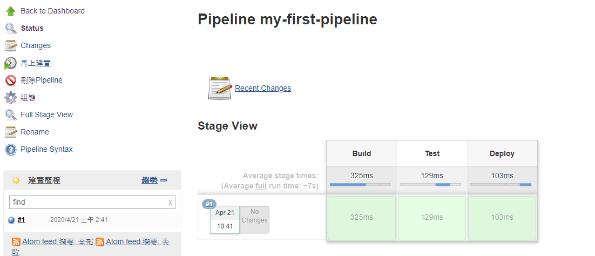

# Jenkins Pipeline - Jenkinsfile
For the resources of this section, please refer to [section13.zip](resources/section13.zip).

## 131. Introduction to Pipeline
This [**session**](https://www.udemy.com/course/jenkins-from-zero-to-hero/learn/lecture/13624054#overview)

## 132. Introduction to Jenkinsfile
This [**session**](https://www.udemy.com/course/jenkins-from-zero-to-hero/learn/lecture/13624060#overview)

## 133. Install the Jenkins Pipeline Plugin
This [**session**](https://www.udemy.com/course/jenkins-from-zero-to-hero/learn/lecture/13624066#overview) is going to learn how to install the Jenkins pipeline plugging.

## 134. Create your first Pipeline
From this [**session**](https://www.udemy.com/course/jenkins-from-zero-to-hero/learn/lecture/13624072#overview), we're going to be creating our first Jenkins pipeline.

* **first-pipeline**
```groovy
pipeline {
    agent any

    stages {
        stage('Build') {
            steps {
                echo 'Building..'
            }
        }
        stage('Test') {
            steps {
                echo 'Testing..'
            }
        }
        stage('Deploy') {
            steps {
                echo 'Deploying....'
            }
        }
    }
}
```

