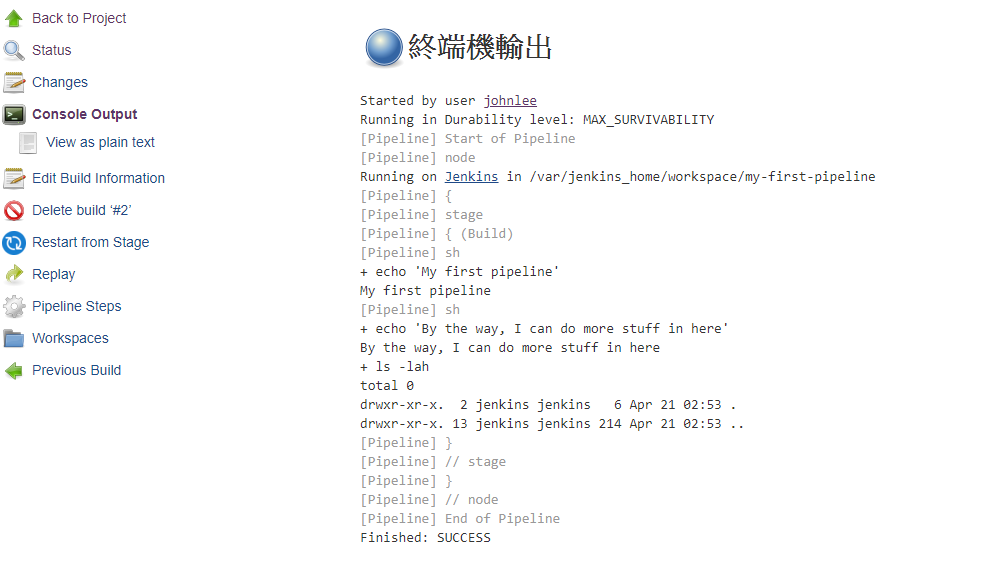
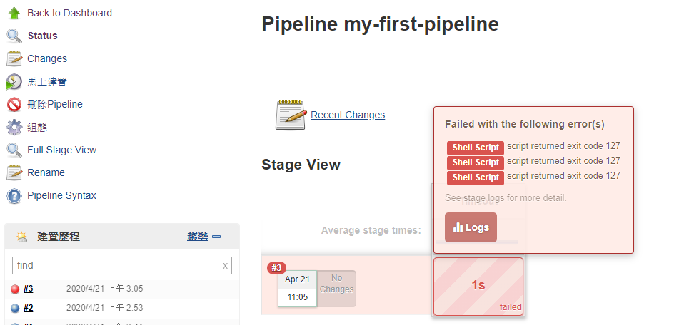
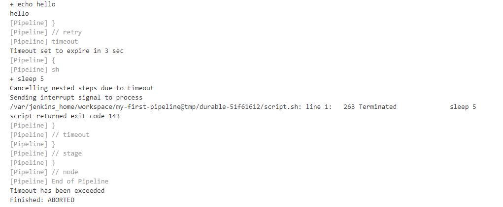
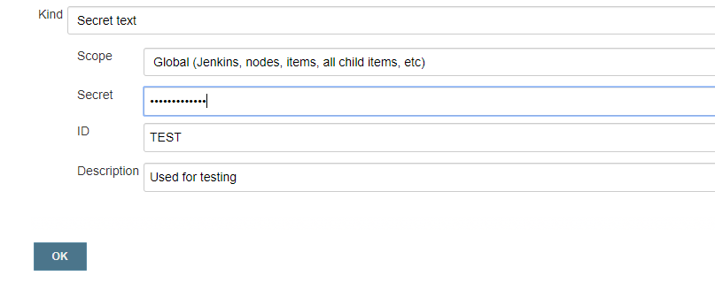
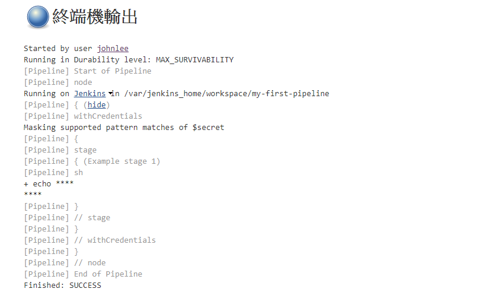
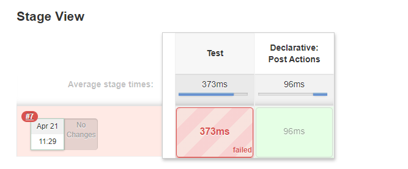

# Jenkins Pipeline - Jenkinsfile
For the resources of this section, please refer to [section13.zip](resources/section13.zip). 
* [Jenkins document - Pipeline](https://jenkins.io/doc/book/pipeline/)

## 131. Introduction to Pipeline
This [**session**](https://www.udemy.com/course/jenkins-from-zero-to-hero/learn/lecture/13624054#overview)

## 132. Introduction to Jenkinsfile
This [**session**](https://www.udemy.com/course/jenkins-from-zero-to-hero/learn/lecture/13624060#overview)

## 133. Install the Jenkins Pipeline Plugin
This [**session**](https://www.udemy.com/course/jenkins-from-zero-to-hero/learn/lecture/13624066#overview) is going to learn how to install the Jenkins pipeline plugging.

## 134. Create your first Pipeline
From this [**session**](https://www.udemy.com/course/jenkins-from-zero-to-hero/learn/lecture/13624072#overview), we're going to be creating our first Jenkins pipeline.

* **first-pipeline**
```groovy
pipeline {
    agent any

    stages {
        stage('Build') {
            steps {
                echo 'Building..'
            }
        }
        stage('Test') {
            steps {
                echo 'Testing..'
            }
        }
        stage('Deploy') {
            steps {
                echo 'Deploying....'
            }
        }
    }
}
```


## 135. Add multi-steps to your Pipeline
From this [**session**](https://www.udemy.com/course/jenkins-from-zero-to-hero/learn/lecture/13624076#overview), we're going to learn how to execute real estate types in our pipeline.
* **multiple-steps**
```groovy
pipeline {
    agent any
    stages {
        stage('Build') {
            steps {
                sh 'echo "My first pipeline"'
                sh '''
                    echo "By the way, I can do more stuff in here"
                    ls -lah
                '''
            }
        }
    }
}
```


## 136. Retry
From this [**session**](https://www.udemy.com/course/jenkins-from-zero-to-hero/learn/lecture/13624080#overview), we're going to learn about retrace in pipeline. ([Timeouts, retries and more](https://jenkins.io/doc/pipeline/tour/running-multiple-steps/#timeouts-retries-and-more))
* **retry**
```groovy
pipeline {
    agent any
    stages {
        stage('Timeout') {
            steps {
                retry(3) {
                    sh 'I am not going to work :c'
                }
            }
        }
    }
}
```


## 137. Timeouts
From this [**session**](https://www.udemy.com/course/jenkins-from-zero-to-hero/learn/lecture/13624084#overview), we're going to learn about time outs in the previous video.
* **timeout**
```groovy
pipeline {
    agent any
    stages {
        stage('Deploy') {
            steps {
                retry(3) {
                    sh 'echo hello'
                }

                timeout(time: 3, unit: 'SECONDS') {
                    sh 'sleep 5'
                }
            }
        }
    }
}
```


## 138. Environment variables
From this [**session**](https://www.udemy.com/course/jenkins-from-zero-to-hero/learn/lecture/13624086#overview), we're going to learn about in Vermont for a vote in our Jenkins file.

* **env**
```groovy
pipeline {
    agent any

    environment {
        NAME = 'ricardo'
        LASTNAME = 'gonzalez'
    }

    stages {
        stage('Build') {
            steps {
                sh 'echo $NAME $LASTNAME'
            }
        }
    }
}
```
## 139. Credentials
From this [**session**](https://www.udemy.com/course/jenkins-from-zero-to-hero/learn/lecture/13624088#overview), we're going to learn about credentials in pipelines. Before working on below pipeline script, you have to create a testing credential as `TEST` (Jenkins > Credentials):


* **creds**
```groovy
pipeline {
    agent any

    environment {
        secret = credentials('TEST')
    }
    stages {
        stage('Example stage 1') {
            steps {
                sh 'echo $secret'
            }
        }
    }
}
```


## 140. Post actions
From this [**session**](https://www.udemy.com/course/jenkins-from-zero-to-hero/learn/lecture/13624090#overview), we're going to learn about post actions in Jenkins files.

* **post-actions**
```groovy
pipeline {
    agent any
    stages {
        stage('Test') {
            steps {
                sh 'echo "Fail!"; exit 1'
            }
        }
    }
    post {
        always {
            echo 'I will always get executed :D'
        }
        success {
            echo 'I will only get executed if this success'
        }
        failure {
            echo 'I will only get executed if this fails'
        }
        unstable {
            echo 'I will only get executed if this is unstable'
        }
    }
}
```

