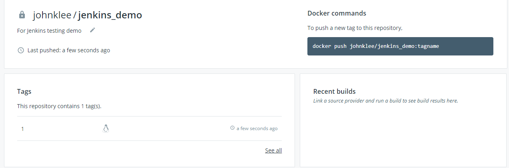

# CI/CD + Jenkins Pipeline + Docker + Maven
For the resources of this section, please refer to [section15.zip](resources/section15.zip).

## 133. Introduction
In this [**session**](https://www.udemy.com/course/jenkins-from-zero-to-hero/learn/lecture/13664346#overview), we're going to be building out real pipeline using Jenkins file continuous integration.

## 134. Learn how to install Docker inside of a Docker Container
In this [**session**](https://www.udemy.com/course/jenkins-from-zero-to-hero/learn/lecture/13664352#overview), we're going to learn how to install doctor inside of a doctor container.

## 135. Define the steps for your Pipeline
In this [**session**](https://www.udemy.com/course/jenkins-from-zero-to-hero/learn/lecture/13664360#overview), we're going to define the steps that our pipeline will execute.

## 136. Build: Create a Jar for your Maven App using Docker
In this [**session**](https://www.udemy.com/course/jenkins-from-zero-to-hero/learn/lecture/13713958#overview), we're going to learn how to create a jar how to build a maybe an application using Docker. Firstly, let's pull the necessary image:
```console
# docker pull maven:3-alpine
```
Unzip the resource file into current working dir:
```console
# unzip resources/section14.zip -d ./
# cd jenkins-pipeline/pipeline/
# ls
Dockerfile  java-app  jenkins  Jenkinsfile
```
Then we can start the container to build target app:
```console
# docker run --rm -it -v $PWD/java-app/:/app -v /root/.m2/:/root/.m2/ -w /app maven:3-alpine sh
/app # ls
README.md  jenkins    pom.xml    src        target
/app # mvn package
```
Now we are inside container and build the target app. Or you can execute below command to build directly:
```console
//  -B,--batch-mode                        Run in non-interactive (batch) mode (disables output color)
# docker run --rm -it -v $PWD/java-app/:/app -v /root/.m2/:/root/.m2/ -w /app maven:3-alpine mvn -B -DskipTests clean package
```
You can observe the line `Building jar: /app/target/my-app-1.0-SNAPSHOT.jar` which disclose the location of target jar file.

## 137. Build: Write a bash script to automate the Jar creation
In this [**session**](https://www.udemy.com/course/jenkins-from-zero-to-hero/learn/lecture/13713968#overview), we're going to automate the process of creating the jar using Ducker because probably. Check `mvn.sh`:
```bash
#!/bin/bash

echo "***************************"
echo "** Building jar ***********"
echo "***************************"

WORKSPACE=$PWD

docker run --rm  -v  $WORKSPACE/java-app:/app -v /root/.m2/:/root/.m2/ -w /app maven:3-alpine "$@"
```

## 138. Build: Create a Dockerfile and build an image with your Jar
In this [**session**](https://www.udemy.com/course/jenkins-from-zero-to-hero/learn/lecture/13713972#overview), we're going to learn how to create a darker image using that yard that we are generating using Maven. 
```console
# cd jenkins/build/
# docker build -f Dockerfile-Java -t test-app .
# docker images | grep test-app
# docker run test-app
Hello from Pipeline!
```

## 139. Build: Create a Docker Compose file to automate the Image build process
In this [**session**](https://www.udemy.com/course/jenkins-from-zero-to-hero/learn/lecture/13713976#overview), we're going to learn how to create a doctor composed file to automatically build our image.
* **docker-compose-build.yml**
```yaml
version: '3'
services:
  app:
    image: "maven-project:$BUILD_TAG"
    build:
      context: .
      dockerfile: Dockerfile-Java
```
Then you can build the image by command:
```console
#  export BUILD_TAG=1
#  docker-compose -f docker-compose-build.yml build
Building app
Step 1/4 : FROM openjdk:8-jre-alpine
 ---> f7a292bbb70c
Step 2/4 : RUN mkdir /app
 ---> Using cache
 ---> bc769d2de05e
Step 3/4 : COPY *.jar /app/app.jar
 ---> b2646c624e03
Step 4/4 : CMD java -jar /app/app.jar
 ---> Running in 88c227f9fb4d
Removing intermediate container 88c227f9fb4d
 ---> 5b81257a1697
Successfully built 5b81257a1697
Successfully tagged maven-project:1
```
## 140. Build: Write a bash script to automate the Docker Image creation process
In this [**session**](https://www.udemy.com/course/jenkins-from-zero-to-hero/learn/lecture/13713984#overview) we're going to learn how to automate everything that we have done so far.
* **jenkins/build/build.sh**
```bash
#!/bin/bash

# Copy the new jar to the build location
cp -f java-app/target/*.jar jenkins/build/

echo "****************************"
echo "** Building Docker Image ***"
echo "****************************"

cd jenkins/build/ && docker-compose -f docker-compose-build.yml build --no-cache
```
This build script is going to be execute to be the same working directory as `Jenkinsfile`. (e.g.: `udemy_jenkins_from_zero_2_hero/jenkins-pipeline/pipeline`)

## 141. Build: Add your scripts to the Jenkinsfile
In this [**session**](https://www.udemy.com/course/jenkins-from-zero-to-hero/learn/lecture/13713990#overview) we're going to use our two scripts to generate a full new darker image using our code.
* **Jenkinsfile**
```groovy
pipeline {

    agent any

    environment {
        PASS = credentials('registry-pass')
    }

    stages {

        stage('Build') {
            steps {
                sh '''
                    ./jenkins/build/mvn.sh mvn -B -DskipTests clean package
                    ./jenkins/build/build.sh

                '''
            }
        }
        ...
    }
}
```

## 142. Test: Learn how to test your code using Maven and Docker
In this [**session**](https://www.udemy.com/course/jenkins-from-zero-to-hero/learn/lecture/13713998#overview) we're going to learn how to test our code using Docker so if we go to our folder Jenkins.
```console
# export WORKSPACE=`pwd`
# docker run --rm  -v  $WORKSPACE/java-app:/app -v /root/.m2/:/root/.m2/ -w /app maven:3-alpine mvn test
...
Results :

Tests run: 2, Failures: 0, Errors: 0, Skipped: 0

[INFO] ------------------------------------------------------------------------
[INFO] BUILD SUCCESS
[INFO] ------------------------------------------------------------------------
[INFO] Total time: 1.893 s
[INFO] Finished at: 2020-05-02T05:23:51Z
[INFO] Final Memory: 10M/141M
[INFO] ------------------------------------------------------------------------
```

## 143. Test: Create a bash script to automate the test process
In this [**session**](https://www.udemy.com/course/jenkins-from-zero-to-hero/learn/lecture/13714010#overview) we're going to create a script to automatically execute this command.
* **jenkins/test/mvn.sh**
```bash
#!/bin/bash

echo "***************************"
echo "** Testing the code *******"
echo "***************************"
# WORKSPACE=/home/jenkins/jenkins-data/jenkins_home/workspace/pipeline-docker-maven
WORKSPACE=`pwd`

docker run --rm  -v  $WORKSPACE/java-app:/app -v /root/.m2/:/root/.m2/ -w /app maven:3-alpine "$@"
```

## 144. Test: Add your test script to Jenkinsfile
In this [**session**](https://www.udemy.com/course/jenkins-from-zero-to-hero/learn/lecture/13714018#overview) we're going to add our script to our Jenkins file so remember dying order to test every code we already created.
* **Jenkinsfile**
```groovy
...
        stage('Test') {
            steps {
                sh './jenkins/test/mvn.sh mvn test'
            }

            post {
                always {
                    junit 'java-app/target/surefire-reports/*.xml'
                }
            }
        }
...        
```

## 145. Create a remote machine to deploy your containerized app
At this point we're going to be creating a new virtual machine because that's going to be the target machine. ([more](https://www.udemy.com/course/jenkins-from-zero-to-hero/learn/lecture/13714034#overview))
* **jenkins/push/push.sh**
```bash
#!/bin/bash

echo "********************"
echo "** Pushing image ***"
echo "********************"

IMAGE="maven-project"

echo "** Logging in ***"
docker login -u ricardoandre97 -p $PASS
echo "*** Tagging image ***"
docker tag $IMAGE:$BUILD_TAG ricardoandre97/$IMAGE:$BUILD_TAG
echo "*** Pushing image ***"
docker push ricardoandre97/$IMAGE:$BUILD_TAG
```

## 146. Push: Create your own Docker Hub account
In this [**session**](https://www.udemy.com/course/jenkins-from-zero-to-hero/learn/lecture/13714044#overview) we're going to learn how to create a repository to store our doctor images in Docker Hub.


## 147. Push: Create a Repository in Docker Hub
In this [**session**](https://www.udemy.com/course/jenkins-from-zero-to-hero/learn/lecture/13714050#overview) we're going to learn how to create a dog or a hop repository.
```console
# docker tag maven-project:1 johnklee/jenkins_demo:1
# docker push johnklee/jenkins_demo:1
```
Then you can check your docker hub account:


## 149. Push: Write a bash script to automate the push process
In this [**session**](https://www.udemy.com/course/jenkins-from-zero-to-hero/learn/lecture/13714078#overview) we're going to automate the process of pushing images to our registry. Firstly, let's modify `jenkins/build/docker-compose-build.yml` to have the correct image name according to the repository you created in docker hub:
* **jenkins/build/docker-compose-build.yml**
```yaml
version: '3'
services:
  app:
    image: "johnklee/jenkins_demo:$BUILD_TAG"
    build:
      context: .
      dockerfile: Dockerfile-Java
```

Then it is time to create bash file to push image to repository:
* **jenkins/push/push.sh**
```bash
#!/bin/bash

echo "********************"
echo "** Pushing image ***"
echo "********************"

IMAGE="jenkins_demo"

echo "** Logging in ***"
echo $PASS | docker login -u johnklee --password-stdin
# echo "*** Tagging image ***"
# docker tag $IMAGE:$BUILD_TAG johnklee/$IMAGE:$BUILD_TAG
echo "*** Pushing image ***"
docker push johnklee/$IMAGE:$BUILD_TAG
```
## 150. Push: Add your push script to Jenkinsfile
In this [**session**](https://www.udemy.com/course/jenkins-from-zero-to-hero/learn/lecture/13714086#overview) we're going to add these is crib that we just created to our Jenkins file.
* **Jenkinsfile**
```groovy
...
        stage('Push') {
            steps {
                sh './jenkins/push/push.sh'
            }
        }
...
```
